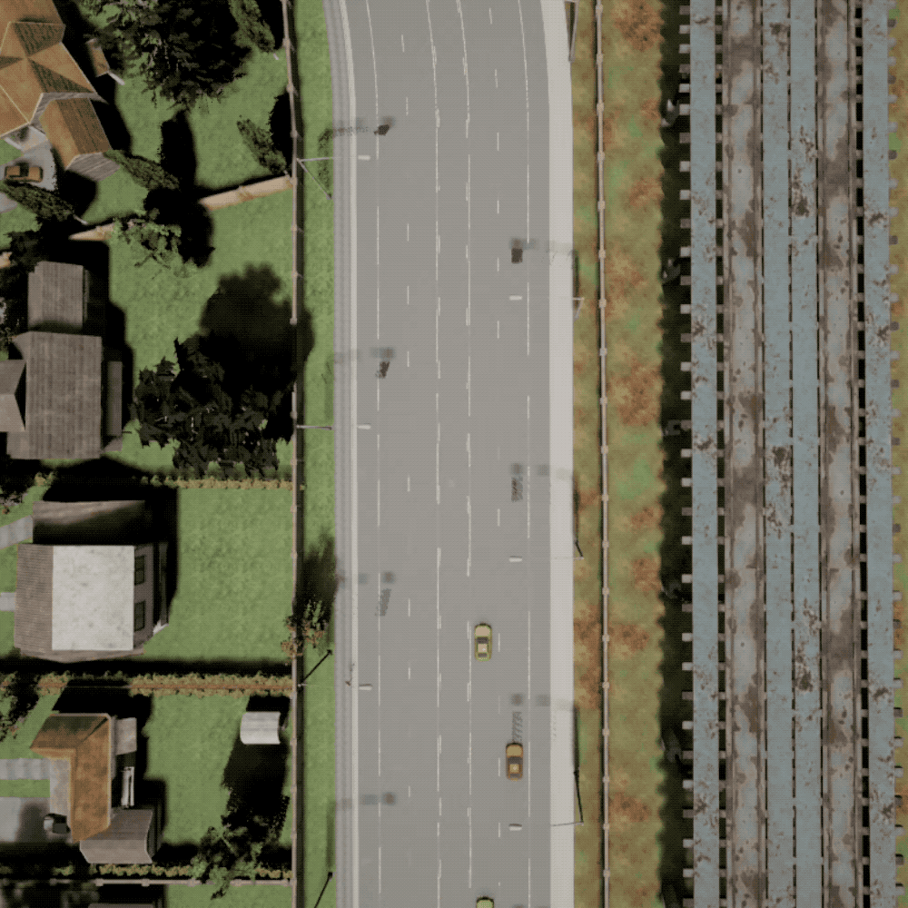

# OVERTAKE_data

## Overview

Our dataset contains about fifteen hours of driving data including **easy mode**, **medium mode**, **hard mode**, and we record data and motion commands at 10 frames per second. The labeling contains steering angle, accelerator and brake.

## About data

The dataset is divided into 3 folders according to difficulty, e.g., easy, mdium and hard. Dataset of same difficulty is divided into 5 csv files according to episode. Every difficulty level of dataset contains nearly 1300 episodes, and they are divided into separate csv files every 300 episodes. An episode means a process from the starting point to the end point. In each csv file, there are 29 columns and many number of rows which stands for a frame sampled. The first 2 columns is the episode and frame number. Note that an episode may contain different number of frames. The other 27 columns is the vhehicles' data. The first four data denote the coordinates of X and Y,  the speed values along the X and Y directions, repsectively. The last senven data are the accelerator and brake values, the steering angle of the ego-vehicle,  the distances from the center of the ego-vehicle to the left and right lane lines of the current lane,  the distances from the center of the ego-vehicle to the left and right road boundaries, repsectively. 

## Overtaking example
This is an example of ego vehicle overtaking other vehicle:
